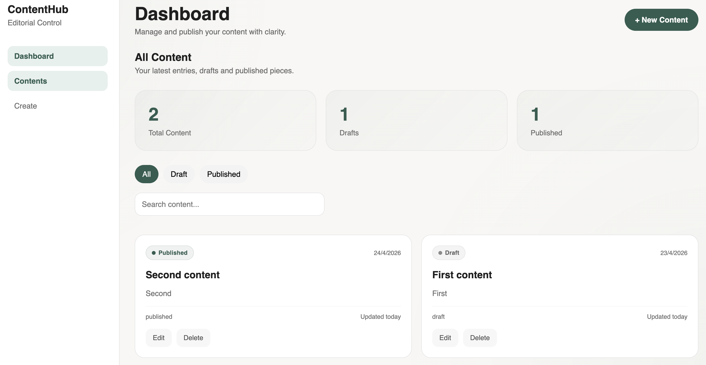
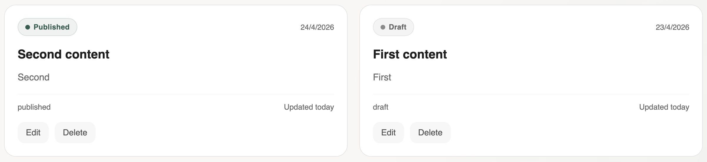
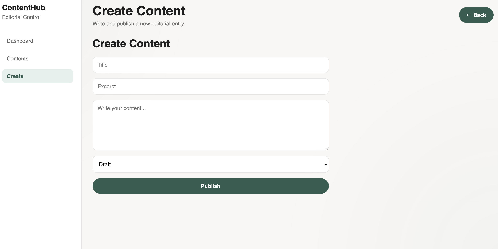

# ContentHub — Mini CMS

ContentHub is a modern editorial CMS built with React and Laravel, designed to provide a clean and focused content management experience.

The project combines a minimalist editorial interface with full CRUD functionality, real-time filtering, search capabilities and polished UI interactions inspired by modern SaaS and publishing platforms.


## Overview

ContentHub was developed as a full-stack project focused on creating a professional editorial dashboard experience rather than a basic CRUD application.

The interface was designed with strong attention to hierarchy, spacing, usability and interaction feedback to create a more refined product-oriented experience.


## Features 
- Create, edit and delete content
- Draft and published content states
- Real-time search functionality
- Content filtering system
- Editorial dashboard metrics
- Toast feedback notifications
- Inline delete confirmation flow
- Smooth UI animations and hover states
- Empty state handling
- Responsive layout structure
- Environment variable configuration for deployment


## Tech Stack

### Frontend

- React
- Vite
- CSS3

### Backend

- Laravel
- REST API architecture

### Other

- Environment variables for API management
- Modular component structure
- Git version control

## Project Structure

```plaintext
ContentHub — Mini CMS/
├── contenthub-api/        # Laravel backend API
├── contenthub-frontend/   # React frontend
├── screenshots/
└── README.md
```


## UI & UX Focus

The project places strong emphasis on:

- Editorial-inspired layout design
- Clean visual hierarchy
- Polished interaction feedback
- Lightweight animations
- Readable content structure
- Intuitive dashboard navigation


## Screenshots

### Dashboard Overview



### Content Cards



### Create Content Flow



## Local Development

### Backend

```bash
cd contenthub-api
php artisan serve
```

### Frontend

```bash
cd contenthub-frontend
npm install
npm run dev
```


## Environment Variables

Frontend uses environment variables for API configuration.

Create a .env file inside contenthub-frontend:

```env
VITE_API_URL=http://127.0.0.1:8000
```


## Future Improvements

- Authentication system
- Rich text editor
- Media uploads
- Content scheduling
- Dark mode
- Analytics dashboard
- Role-based permissions


## Author

### Claudia Aguilar

Frontend Developer focused on modern UI systems, editorial experiences and full-stack web applications built with React and Laravel.

